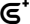

<div align=center>

</div>
<div align=center>


</div>


[github](https://github.com/lt-liam/Secufox): https://github.com/lt-liam/Secufox

Secufox is a contract scanning tool that integrates multiple security scanning apis and displays them uniformly

# Project Guidelines

## 1. Basic Introduction

### 1.1 Project Introduction

> Secufox is a contract scanning tool that integrates multiple security scanning apis and displays them uniformly

### 1.2 Contributing Guide

Hi! Thank you for choosing Secufox.

We are excited that you are interested in contributing to Secufox. Before submitting your contribution though, please make sure to take a moment and read through the following guidelines.

#### 1.2.1 Issue Guidelines

- Issues are exclusively for bug reports, feature requests and design-related topics. Other questions may be closed directly.

- Before submitting an issue, please check if similar problems have already been issued.

#### 1.2.2 Pull Request Guidelines

- Fork this repository to your own account. Do not create branches here.

- Commit info should be formatted as `[File Name]: Info about commit.` (e.g. `README.md: Fix xxx bug`)

- If your PR fixes a bug, please provide a description about the related bug.

- Merging a PR takes two maintainers: one approves the changes after reviewing, and then the other reviews and merges.

### 1.3 Version list

- main: 1.0.0 

## 2. Getting started

```
- node version > v16.18.0
- IDE recommendation: WebStorm,Visual Studio Code
```

### 2.1 server project

```bash

# clone the project
$ git clone https://github.com/lt-liam/Secufox.git

# install frontend dependency
$ npm install

# start server
$ npm run dev

```

## 3. Technical selection

- using [ant-design-vue](https://www.antdv.com/components/overview) based on [Vue](https://vuejs.org)，to code the page.

## 4. Project Architecture

### 4.1 Project Layout

```       
    ├─public                
    ├─src
    │  ├─assets        
    │  ├─components      
    │  └─theme      
    │      ├─App.vue 
    │      ├─main.js
    │      └─style.css  
    ├─.gitignore
    ├─index.html    
    ├─package.json      
    ├─README.md          
    └─vite.config.js 

```

## 5. Features

- Contract Security Check 
- Contract Code Audit

## 6. Knowledge base

### 6.1 API Support

*  [Goplus](gopluslabs.io)
*   [AveAi](https://ave.ai/)
*  [Biting](https://ceye.bitying.cn/)

## 7. Contributors

Thank you for considering your contribution to hamster!

<a href="https://github.com/lt-liam/Secufox/graphs/contributors">
  
</a>

## 8. Commercial considerations

If you use this project for commercial purposes, please comply with the Apache2.0 agreement and retain the author's technical support statement.
